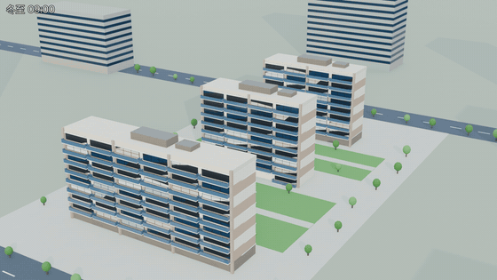
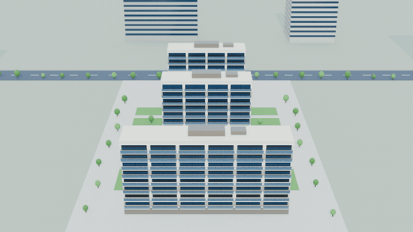

# 前滩尚品 · 一房一价 & 日照

上海前滩尚品首批次（5幢 / 8幢 / 11幢，共 113 套）的一房一价与冬至日照数据整理、校验，
以及一个单文件 3D 交互可视化。

## 在线查看

GitHub Pages：**https://caoliangqiang.github.io/QTXP/**

## 效果图与日照动画

Blender 5.2 + Cycles（Metal GPU）离线渲染，几何由 `.build/units.json` 程序化生成，
尺度按真实米制（层高 3.0 m、进深 11 m、檐高 28.2 m）。

| 产物 | 说明 |
| --- | --- |
| `renders/01_东南鸟瞰.jpg` | 冬至正午，东南向鸟瞰 |
| `renders/02_正午长影.jpg` | 9:15 低角度，长影投向西北 |
| `renders/03_俯视总平.jpg` | 俯视，看南北三排关系与地面阴影 |
| `renders/04_单价着色.jpg` | 窗面按单价着色，与网页同一色阶 |
| `renders/05_日照着色.jpg` | 窗面按日照时长着色，沿用宣传图图例配色 |
| `renders/冬至日照动画.mp4` | 冬至 9–15 时逐帧推进太阳（73 帧，5 分钟步长） |
| `renders/环绕.mp4` | 绕场地一圈（72 帧） |
| `renders/*.gif` | 上面两个动画的 GIF 版，供 README 内联显示 |





主光源按上海冬至正午的真实太阳位置设置（NOAA 算法，正午高度角 35.33°，
与解析值 90−31.23−23.44 零偏差），因此画面里的阴影方向和长度都是算出来的，不是摆出来的。

## 文件

| 文件 | 说明 |
| --- | --- |
| `前滩尚品_一房一价_日照.xlsx` | 主数据。含「汇总」长表、「房号分布」矩阵表，以及 5幢/8幢/11幢 分幢明细 |
| `前滩尚品_3D可视化.html` | 单文件 3D 可视化，双击即可打开，不需联网 |
| `index.html` | 与上一行内容完全相同，供 GitHub Pages 以根路径提供访问 |
| `前滩尚品_3D可视化_预览.png` | 可视化首屏预览图 |
| `renders/` | Blender 渲染成品（效果图 JPEG、日照动画与环绕的 mp4/gif） |
| `.build/` | 可视化的模板、vendored 依赖与构建脚本 |
| `.build/blender/` | Blender 场景脚本、日照反推脚本与合成脚本 |

> 原始数据来源图（小胖看房团发布的一房一价表 & 日照时长图）带其水印，
> 仅在本地留档作为数据出处，**不随本仓库分发**。

## 数据校验结论

以 `20260919-205901.jpeg` 为准，对 Excel 做了逐格核对与全量内部一致性验证，**未发现录入错误**：

- 113 套有效房源，`总价 = 建筑面积 × 单价` 全部吻合（误差 < 0.01 万）
- `楼层单价差 = 本层单价 − 下层同房号单价` 全部吻合；缺层与底层正确标注为 `—`
- 24 个「整列均价」等于该房号各层单价的算术平均，与宣传图标注一致
- 本期住宅均价 107,160 元/m² = 总金额 123,858.28 万 ÷ 总面积 11,558.24 m²（金额加权口径；
  若按单价简单平均为 107,144，口径不同）
- 名义楼层映射：实际 2→2、3→3、4→5 … 9→10（跳过「4」），全表一致
- 结构性缺失：5幢 3层 02室、8幢 1层的两个 02室 —— 与宣传图一致

### 三处源数据疑点（宣传图本身如此，非录入问题）

1. **5幢 9号01室 9层**：单价 106,150、价差 −3,633，而同层其余三户均为 −3,100。
   若按 −3,100 推算应为 106,683（正好等于 8号02室 同层价）。全表唯一的 −3,100 偏离。
2. **8幢 1层「越低越贵」**：1层只有 01室（88.73 / 88.81 m² 小户型），单价 97,696
   高于 2层的 95,784，因此 22号01室 2层价差为 −1,912、23号01室 为 +1,893。小户型单价溢价所致。
3. **11幢 1 元尾差**：8层 29号01室 110,365 vs 28/27号 110,366；9层价差 −3,682 vs −3,683。

## 楼栋关系

场地自南向北依次 **11幢 → 8幢 → 5幢**，与日照数据互相印证：

| 位置 | 楼栋 | 最低日照 | 满照(5.5h) |
| --- | --- | --- | --- |
| 最南 | 11幢 | 5.5 h | 48 / 48（无遮挡） |
| 中 | 8幢 | 4.5 h（1层） | 31 / 34 |
| 最北 | 5幢 | 2 h（2层） | 21 / 31 |

可视化的主光源按上海冬至正午设置（正南、太阳高度角 ≈ 35°），地面阴影方向即实际遮挡方向。

### 楼间距是反推出来的，不是猜的

公开渠道拿不到项目总平面图，所以把未知量反过来用已知的日照数据**拟合**：
按真实太阳轨迹（NOAA 算法，上海 31.23°N / 121.47°E，冬至 9–15 时每 5 分钟采样 73 点），
对候选间距逐一做射线-长方体遮挡计算，取最能复现各层日照时长的那个值。

| 拟合对象 | 依据 | 最优间距 | 残差 SSE |
| --- | --- | --- | --- |
| 11幢 → 8幢 | 8幢 各层日照（1层 4.5h、2层 5h 的轻微削减） | **42 m** | 0.08 |
| 8幢 → 5幢 | 5幢 各层日照（2层 2h → 5层以上 5.5h 的梯度） | **30 m** | 0.63 |

两处细节值得记录：

1. **宣传图的 5.5h 是封顶值**。6 小时窗口的理论上限就是 6.0h，而最南的 11幢 48 套全部标 5.5h。
   模型对无遮挡户算出的正是 6.00h，所以拟合时先把模型值按同一口径封顶再比较，
   否则这个系统偏差会把间距带偏。
2. **42 m 的残差远小于 30 m**。因为 8幢 只有 1–2 层受轻微遮挡、信号干净；
   而 5幢 的 4 层实测 4.88h、模型给 5.5h，说明真实遮挡比模型略多——
   可能是屋顶机房/楼梯间高出女儿墙，或楼栋并非东西严格对齐。

几何仍有简化：楼栋东西居中、平屋顶、窗取层内中部、不含阳台与凹凸。
所以这两个数字是**有依据的估计**，能支撑南北遮挡的定性规律，但不能当作精确日照分析报告。
要精确仍需真实退距与总平面图。

## 可视化功能

- **几何**：一套房 = 一个盒子；X 轴为房号（顺序同宣传图），Y 轴为实际楼层，Z 轴为南北楼栋
- **5 种着色维度**：单价 / 总价 / 日照时长 / 楼层价差 / 建筑面积
- **交互**：悬停出浮层，单击看明细（含 98 折参考价、整列均价、该房号的价格-楼层曲线）
- **筛选**：总价上限 + 日照下限，不满足的房源半透明；可单独隐藏某一幢
- **购房意向**：按 <kbd>W</kbd> 加入意向，加入顺序即名次；3D 内显示名次徽章与描边；
  支持「只看意向」，以及在意向范围内的逐列对比（每行标注范围内最优）。
  清单存于 localStorage，并可通过 `#wish=...` 深链分享
- **对比清单**：12 项字段可逐项勾选隐藏（选择同样存 localStorage）；
  可导出 **.xlsx**（真 OOXML，数值列为数值型，不是改扩展名的 CSV）、
  **.html**（自包含单文件，可直接打印）或复制为制表符文本粘进 Excel
- **深链**：`#view=side&mode=sun&cmp=1&sel=5幢|9号|01室|9&wish=key1,key2`

### 房号口径

门牌房号 = **名义楼层 + 室号**。开发商的名义层跳过「4」，门牌按名义层编号，
所以 5幢 9号单元 实际 4 层 02室 的房号是 **502室**，全称 `5幢 9号502室`。
表格和 3D 提示中同时给出实际楼层，避免与门牌号混淆。

## 重新构建可视化

可视化是单文件产物，由模板 + 内联依赖 + 数据合成：

```bash
python3 .build/build.py        # 输出 前滩尚品_3D可视化.html
```

- `.build/viz.tpl.html` — 页面与全部逻辑，含 `/*__THREE__*/` `/*__ORBIT__*/` `/*__XLSX__*/` `/*__DATA__*/` 四个占位符
- `.build/three.min.js`、`.build/OrbitControls.js` — three.js r128，已 vendored，构建时无需联网
- `.build/xlsx.js` — 极简 xlsx 写入器（ZIP + OOXML，压缩方法用「存储」以免引入 deflate），
  可用 `node -e 'require("./.build/xlsx.js")' ` 单独测试
- `.build/units.json` — 从 Excel「汇总」表导出的 116 条记录（113 套有效 + 3 条结构性缺失）

修改数据后需重新导出 `units.json`（字段：`b` 楼栋、`u` 单元、`rm` 室号、`fr` 实际层、
`fn` 名义层、`a` 面积、`p` 单价、`t` 总价、`d` 楼层价差、`s` 日照、`note` 备注）。

## 重新渲染效果图与动画

```bash
B=/Applications/Blender.app/Contents/MacOS/Blender
python3 .build/blender/solar.py                                  # 反推楼间距 -> geometry.json
$B -b --factory-startup --python .build/blender/verify.py        # 数值自检（太阳方向/遮挡/取景）
$B -b --factory-startup --python .build/blender/stills.py    -- 160 2560
$B -b --factory-startup --python .build/blender/sun_study.py -- 1600 32 1
$B -b --factory-startup --python .build/blender/turntable.py -- 1280 72 32
bash .build/blender/encode.sh                                    # 合成 mp4/gif/jpg 到 renders/
```

在 M5 Pro（Cycles + Metal）上全量约 3 分钟：效果图 5 张 67 s、日照 73 帧 41 s、环绕 72 帧 34 s。
首次运行 Cycles 会编译 Metal 内核，可能多花几分钟，之后走缓存。

- `solar.py` — NOAA 太阳位置 + 射线遮挡 + 间距拟合，纯标准库，可单独运行
- `scene.py` — 程序化建模、材质、天空与相机，供三个渲染脚本复用
- `verify.py` — 不渲染只校验：太阳出射向量、地面阴影方位、包围盒 8 角点是否入画

## 免责

数据来源为第三方根据公示规划图纸测算，仅供参考，以实际交付与官方公示为准。
